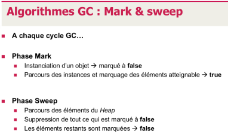
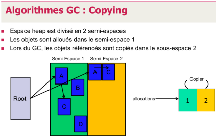

\newpage

# Membre du groupe

- Lucas Bulloni <[lucas.bulloni@he-arc.ch](mailto:lucas.bulloni@he-arc.ch)>

# But du projet

Le but du projet est de créer une simulation graphique de deux algorithmes de Garbage Collector (Copying et Mark and Sweep). Ces algorithmes sont spécifiés dans les deux images ci-dessous.

{ width=60% }\
{ width=60% }\

Les objets en mémoires seront modèlisés sous forme d'arbre et les zones mémoires par des rectangles.

Les deux algorithmes seront représentés séparément. Et les simulations devront pouvoir être mises en pause et exécutées étape par étape.

# Technologie utilisée

La simulation graphique se fera en HTML et Javascript. Cela permet d'avoir une application portable et multiplateforme.

La bibliotèque utilisée sera probablement D3.js.
