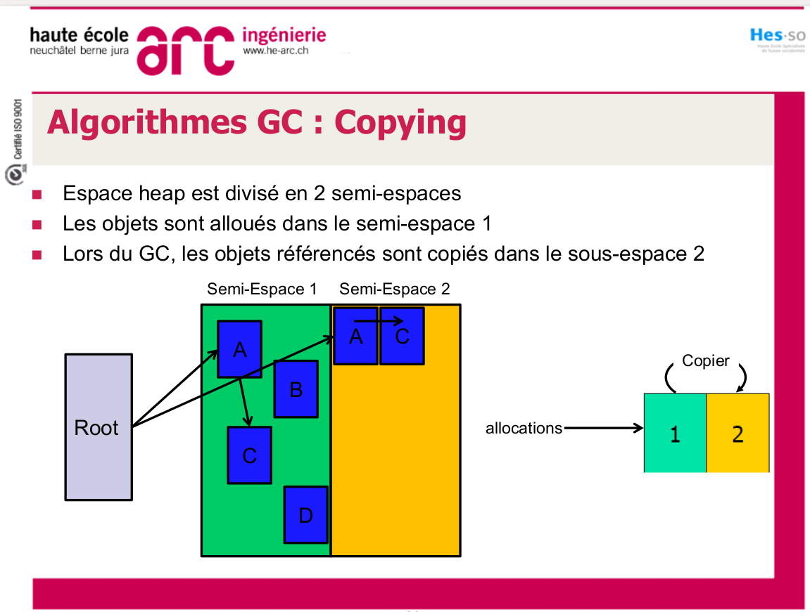
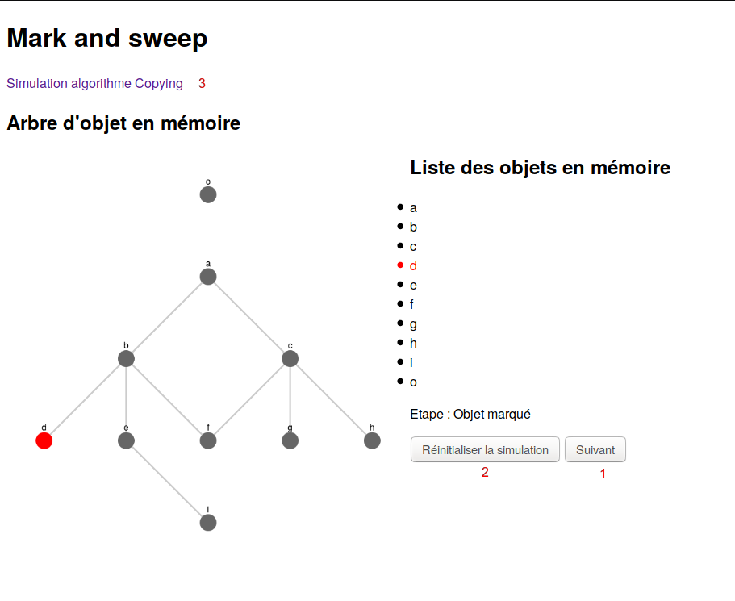
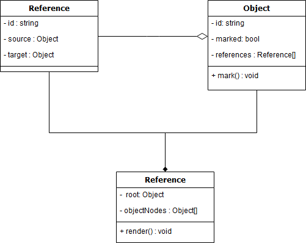

\newpage

\tableofcontents

\newpage

# Introduction

Ce projet consiste en une simulation Javascript pour mettre en illustration les 2 algorithmes de garbage collection vu pendant le cours de J2EE. 

## Mark & Sweep

L'algorithme Mark & Sweep  [@MarkNSweepJEE] consiste à parcours la mémoirs en arbre et de marqués tous les objects qui ont été visités. A la fin de la visite, on supprime tous les noeuds non-marqués. Ensuite il faut supprimer tous les noeuds non-marqués, mais pour cela il faut garder la liste des tous les objets (heap). Voici le pseudo code de l'algorithme :


Il faut visiter toutes les racines pour marqués les enfants : 

```
mark_sweep(root)
    For rootObjet in root
        mark(rootObjet)
    End For
sweep()
```
On va marquer tous les enfants de la racine

```
mark(root)
    If markedBit(root) = false then
        markedBit(root) = true
    For each child referenced by root
        mark(v)
```

Et finalement on va supprimer les racinces

```
sweep()
    For each object o in heap
        If markedBit(o) = true then
            markedBit(o) = false
        else
            heap.release(o)
```

## Copying

L'algorithme Copying est un peu différent, il fonctionne avec 2 zones mémoires. On va parcours la mémoire et au fure et à mesure qu'on parcours les noeuds, on va les copier dans une seconde zone mémoire. Lorsque toute la mémoire atteignable a été copiée, on va supprimer la zone 2.



# Manuel utilisateur

la simulation étant une application javascript. Il faut garder la structure du dossier tel quel. Ensuite il faut ouvrir le fichier index.html ou index-copying.html dans le navigateur.

Le fichier index.html est la simulation Mark & Sweep et index-copying.html la simulation Copying. On peut faire avancer la simulaton avec le bouton "Suivant" [1] et on peut la réinitialiser avec le bouton "Réinitaliser la simulation" [2]. Il y a aussi un lien vers l'autre simulation [3].



Les objets sont représentés par les noeuds avec une lettre, et la référence représente un edge de l'arbre.

La structure de la mémoire n'est faisable qu'uniquement via le code, voici un exemple de code qui permet de construire un arbre comme sur la figure ci-dessus.

```javascript
let a = new Object('a', simulation);
let b = new Object('b', simulation);
let c = new Object('c', simulation);

a.addChildrenObject(b);
a.addChildrenObject(c);

b.addChildrenObject(new Object('d', simulation));
let e = new Object('e', simulation);
b.addChildrenObject(e);

let f = new Object('f', simulation);

b.addChildrenObject(f)

c.addChildrenObject(f);
c.addChildrenObject(new Object('g', simulation));
c.addChildrenObject(new Object('h', simulation));

e.addChildrenObject(new Object('i', simulation));

new Object('o', simulation)

simulation.setRoot(a);
```

Il n'est possible que de setter qu'une seule racine pour l'exécution du programme.


# Réalisation

La simulation a été fait en Javascript et HTML. Cela permet d'avoir une compatilibé multi OS et de pouvoir s'exécuter sur n'importe quelle machine via un navigateur. La bibliothèque cytoscape a été utilisé pour dessiner les arbres. 

## Structure du programme

Le programme a été développé en Javascript. La convention de nommage était d'utiliser l'anglais et le pascalCase.

La structure des fichiers est telle : 

- index.html -> Simulation Mark & Sweep
- index-copying.html -> Simulation Copying
- js
    - main.js -> Gestion des boutons et script principal
    - SimulationCopying.js -> Classe pour Copying
    - SimulationMarkAndSweep.js -> Classe pour Mark & Sweep
    - tree-structure
        - Object.js -> Classe pour la représentation d'un objet (noeud)
        - Reference.js -> Classe pour la représentation d'une référence
- lib -> Dossier de bibliothèques
- css
    - styles.css -> Styles CSS de l'application


## Bibliothèques utilisés

- Cytoscape : Dessin des arbres

La bibliothèque cytoscape a été choisie pour faciliter le dessin d'arbre. Ce qui permet de mieux représenter la mémoire. C'est la bibliothèque qui permettait le mieux de personnalisé l'affichage de l'arbre sans être trop difficile à utiliser. [@Cytoscape]


## Diagramme de classe

Ce diagramme de classe simplifié permet d'expliquer la structure de données plus simplement.



La classe `Object` fait office de noeud et la classe `Reference` fait office d'edge. La classe `Simulation` permet de stocker tout l'arbre et s'occupe de faire le rendu cytoscape, pour le dessin de l'arbre.

# Améliorations possibles

Le projet n'est pas parfait et certaines améliorations pourraient être apportés pour faciliter l'utilisatation

## Affichage des racines du programmes

Actuellement, la racine n'est pas affichée. Ce qui n'est pas intuitif du tout. Un champ au dessus de l'affiche de l'arbre pourrait afficher les racines pour une meilleure compréhension.

## Edition de l'arbre directe

L'arbre de mémoire se modifie uniquement via code, ce serait bien qu'il soit modifiable dirèctement depuis l'interface graphique, ça permettrait à la simulation d'être utilisé sans avoir à coder et se soucier de la structure du programme.

# Conclusion

Pour conclure, la simulation est fonctionnelle mais certains aspects pourraient être amélioré pour une meilleur intéraction avec l'utilisateur. La simulation présente les algorithmes de Garbace Collection Java et a été développé en Javascript.

\newpage

\listoffigures

# References

